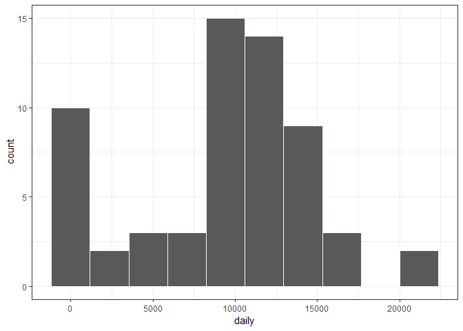
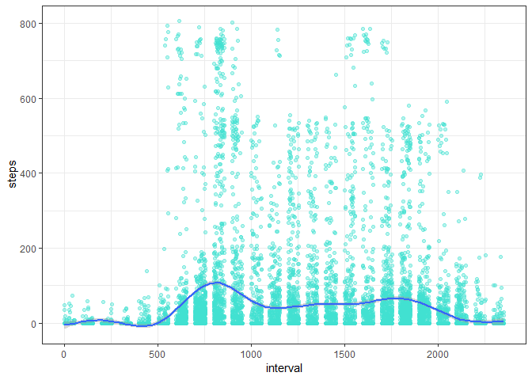
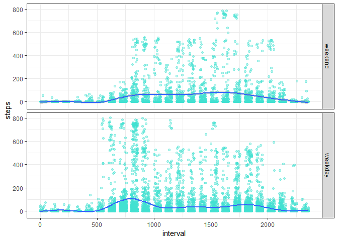

Author: Alicia Carabali

## Loading and preprocessing the data
The data is loaded from the repository folder and a quick look at the dataset is done using the commands head(), and tail().


```r
fullname<-"C:\\Users\\Thinkpad T460S\\Documents\\GitHub\\RepData_PeerAssessment1\\activity\\activity.csv"
datasteps<-read.csv(file = fullname, header = TRUE)
head(datasteps)
```

```
##   steps       date interval
## 1    NA 2012-10-01        0
## 2    NA 2012-10-01        5
## 3    NA 2012-10-01       10
## 4    NA 2012-10-01       15
## 5    NA 2012-10-01       20
## 6    NA 2012-10-01       25
```

```r
tail(datasteps)
```

```
##       steps       date interval
## 17563    NA 2012-11-30     2330
## 17564    NA 2012-11-30     2335
## 17565    NA 2012-11-30     2340
## 17566    NA 2012-11-30     2345
## 17567    NA 2012-11-30     2350
## 17568    NA 2012-11-30     2355
```


## What is mean total number of steps taken per day?

Then, the averaged number of steps per day was proyected in an histogram. From the histogram it can be said that the dirstribution looks "normal" and the mean and median are around 10000 steps per day. The actual calculation of this values show as that the mean is 9354.23 steps, and the median is 10395 steps. We deduct from that, that the distribution is slightly left skeweed.  


```r
library(ggplot2)
```

```
## Warning: package 'ggplot2' was built under R version 3.5.3
```

```r
library(dplyr)
```

```
## Warning: package 'dplyr' was built under R version 3.5.3
```

```
## 
## Attaching package: 'dplyr'
```

```
## The following objects are masked from 'package:stats':
## 
##     filter, lag
```

```
## The following objects are masked from 'package:base':
## 
##     intersect, setdiff, setequal, union
```

```r
datasteps1<-group_by(datasteps, date)
byday<-summarise(datasteps1, daily = sum(steps,na.rm = TRUE))
ggplot(byday, aes(daily))+geom_histogram(na.rm = TRUE, color = "seashell1", bins = 10)+theme_bw()
```

<!-- -->

```r
meansteps<-mean(byday$daily,na.rm = TRUE)
meansteps
```

```
## [1] 9354.23
```

```r
mediansteps<-median(byday$daily,na.rm = TRUE)
mediansteps
```

```
## [1] 10395
```

## What is the average daily activity pattern?
Then an average of the daily activity was plotted using ggplot, the interval at which there were more steps was 615, and the maximum number of steps was 806. 


```r
ggplot(datasteps, aes(interval,steps))+geom_point(na.rm = TRUE, color = "turquoise", alpha = 0.4)+geom_smooth(na.rm = TRUE)+theme_bw()
```

```
## `geom_smooth()` using method = 'gam' and formula 'y ~ s(x, bs = "cs")'
```

<!-- -->

```r
maximumnumberofsteps<-max(datasteps$steps,na.rm = TRUE)
maximumnumberofsteps
```

```
## [1] 806
```

```r
internalwithmoresteps<-datasteps$interval[which.max(datasteps$steps)]
internalwithmoresteps
```

```
## [1] 615
```

## Imputing missing values
Continuing with the procesing a code was developed for replace the NA values , by the mean of the day. Even though this was calculated as is shown in the code, it was easier just to replace by 0 because no data was taken in the days were NA values existed. Other option was to replace with the average values of all the day at the same interval, but that was not done in this case. The head() and tail() of the new dataset is presented.  

The histogram is implemented, but it is exactly the same that before the replacement, because the NA values were replaced by 0, and in the first case were ignored using na.rm. The same happens for the median and mean values.


```r
totalNA<-sum(is.na(datasteps$steps))
totalNA
```

```
## [1] 2304
```

```r
library(lubridate)
```

```
## Warning: package 'lubridate' was built under R version 3.5.3
```

```
## 
## Attaching package: 'lubridate'
```

```
## The following object is masked from 'package:base':
## 
##     date
```

```r
N=0
for (var in datasteps$steps){
  N=N+1
   if(is.na(var)){
     K=0
    for( var1 in byday$date){
      K=K+1
      if(date(var1)==date(datasteps$date[N])){
        datasteps$steps[N]<-byday$daily[K]
      }
    } 
  }
}
datasteps1<-group_by(datasteps, date)
byday<-summarise(datasteps1, daily = sum(steps,na.rm = TRUE))
head(datasteps)
```

```
##   steps       date interval
## 1     0 2012-10-01        0
## 2     0 2012-10-01        5
## 3     0 2012-10-01       10
## 4     0 2012-10-01       15
## 5     0 2012-10-01       20
## 6     0 2012-10-01       25
```

```r
tail(datasteps)
```

```
##       steps       date interval
## 17563     0 2012-11-30     2330
## 17564     0 2012-11-30     2335
## 17565     0 2012-11-30     2340
## 17566     0 2012-11-30     2345
## 17567     0 2012-11-30     2350
## 17568     0 2012-11-30     2355
```

```r
ggplot(byday, aes(daily))+geom_histogram(na.rm = TRUE, color = "seashell1", bins = 10)+theme_bw()
```

<!-- -->

```r
meansteps1<-mean(byday$daily,na.rm = TRUE)
meansteps1
```

```
## [1] 9354.23
```

```r
mediansteps1<-median(byday$daily,na.rm = TRUE)
mediansteps1
```

```
## [1] 10395
```
## Are there differences in activity patterns between weekdays and weekends?
Finally, an aditional variable was added to the dataset in order to determinate if the measurement is for a weekday or for a weekend. The plot representing the activity in the different type of days was done. It can be concluded that in the weekdays there was more activity than in the weekends, and also that the peak of more activity is later in the weekends than in the weekdays.


```r
datasteps<-mutate(datasteps, daytype=factor(wday(date(datasteps$date)), levels = c(1,2,3,4,5,6,7), labels = c("weekend", "weekday", "weekday","weekday","weekday","weekday","weekend")))

ggplot(datasteps, aes(interval,steps))+geom_point(na.rm = TRUE, color = "turquoise", alpha = 0.4)+geom_smooth(na.rm = TRUE)+theme_bw()+facet_grid(datasteps$daytype ~ .)
```

```
## `geom_smooth()` using method = 'gam' and formula 'y ~ s(x, bs = "cs")'
```

<!-- -->
